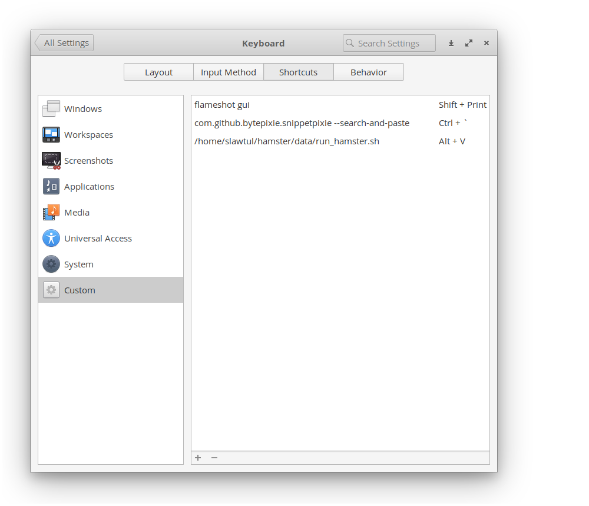
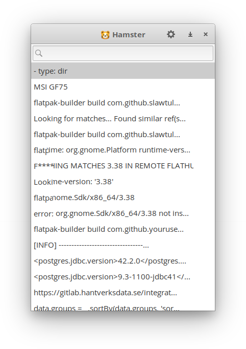
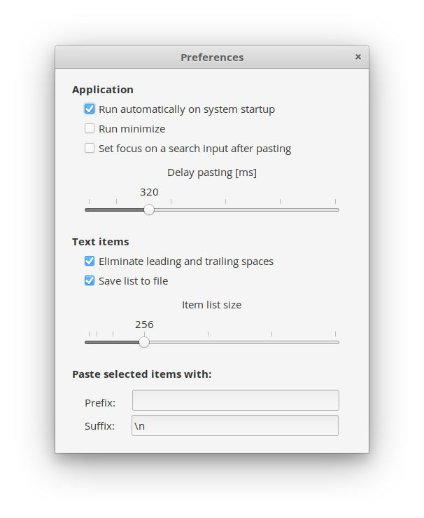
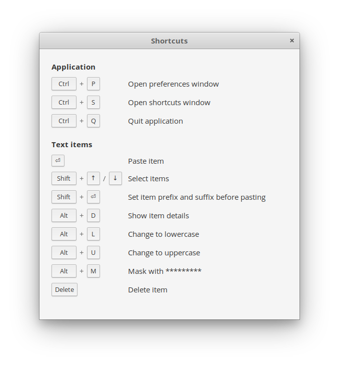

# Hamster

Clipboard manager for Elementary OS

_Key features:_

* Paste multiple items at once
* Save items to a file
* Paste selected items with prefix and suffix
* Transform an item to uppercase or lowercase
* Mask an item with *******

## Development

Before running app on you local machine, make sure you have installed below libs:

```bash
sudo apt install elementary-sdk gtkmm-3.0 libxt-dev wmctrl
```

## How to build

```bash
cd hamster
meson build --prefix=/usr
cd build
ninja
ninja install
```

## Open / Restore app with custom keybinding

Inside `hamster/data` folder there is placed a `run_hamster.sh` file which you can bind to custom shortcut. I recommend
a `ALT+V` key combination.
`run_hamster.sh` file **opens** an application or **restores** if minimized. `run_hamster.sh` uses **wmctrl**



### Known issues

#### 1. Pinned screenshot from Flameshot app

You cannot paste text if you took a screenshot and pinned to desktop

#### 2. About text item masking

You can mask passwords with stars ****** but remember if you chose _'Save list to file'_ in 'Preferences' window your
password will be save as __plain text__ in ~/.config/hamster/item.json file

```json
{
  "items": [
    {
      "display_value": "A******3",
      "value": "Admin123"
    }
  ]
}
```

## Screenshots






